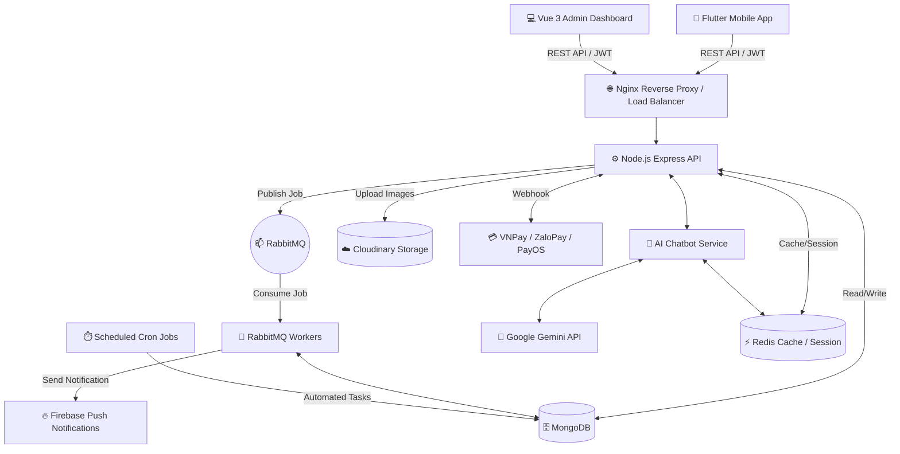

# 🌟 S-Shop: Comprehensive E-Commerce Platform

Welcome to **S-Shop**, a full-featured, high-performance E-Commerce platform designed to deliver a seamless shopping experience for customers and powerful management tools for administrators. 

This project is built with a modern, decoupled microservices-like architecture, integrating a cross-platform mobile app, a web-based admin dashboard, a robust backend API, and a highly intelligent AI chatbot assistant.

---

## 🏗 Bird's Eye View: System Architecture

The S-Shop ecosystem is divided into several highly specialized layers to ensure maximum scalability, maintainability, and performance even during high-traffic events like Flash Sales.

### Architecture Diagram (Conceptual)


---

## 🚀 The Technology Stack (By Module - Audited & Verified)

### 1. 📱 Mobile App (Customer Facing)
Located in `ecommerce_user_FE/`
The customer-facing application is built for extreme fluidity and cross-platform compatibility.
- **Framework:** Flutter (Dart) - Single codebase compiling to native iOS and Android.
- **State Management:** Riverpod & Provider (Dual-pattern usage for scalable, reactive state handling).
- **Authentication:** Google Sign-In, Custom JWT-based Email/Password Auth.
- **Local Storage:** `flutter_secure_storage` for encrypted tokens, `shared_preferences` for non-sensitive app settings.
- **Networking:** `http` package with custom wrappers for robust API calls and interceptors.
- **Push Notifications:** Firebase Cloud Messaging (`firebase_messaging`, `flutter_local_notifications`).
- **UI/UX:** Material Design 3, custom animations (`flutter_animate`), slidable lists (`flutter_slidable`), and grid views for product catalogs.

### 2. 💻 Admin Dashboard (Management Interface)
Located in `ecommerce_admin_FE/`
A responsive web interface for store owners and managers to control inventory and track orders.
- **Framework:** Vue.js 3 (Composition API) for a modern, lightweight, reactive UI.
- **Build Tool:** Vite for blazing-fast Hot Module Replacement (HMR) and optimized production builds.
- **HTTP Client:** Axios with highly customized global request/response interceptors to handle seamless Token Refresh logic and race conditions.
- **Routing:** Vue Router with Navigation Guards to protect admin-only routes and handle automated redirects upon token expiration.
- **Styling:** Custom CSS (`style.css`) without relying on heavy external UI frameworks, ensuring minimal bundle size.

### 3. ⚙️ Core Backend API
Located in `ecommerce_backend/`
The brain of the system, handling business logic, data persistence, and security.
- **Runtime:** Node.js (v18+)
- **Framework:** Express.js utilizing an MVC (Model-View-Controller) pattern.
- **Database:** MongoDB with Mongoose ODM (`mongoose`).
- **Caching & Sessions:** Redis (`redis`) for extremely fast read operations and session management.
- **Authentication:** JWT (JSON Web Tokens) with access and refresh strategies, password hashing via `bcryptjs`.
- **File Uploads:** `multer` integrated with Cloudinary (`multer-storage-cloudinary`) for optimized image delivery and CDN caching.
- **Payment Processing:** Integrated natively with **VNPay**, **ZaloPay**, and **PayOS** including secure webhook listeners.
- **Push Notifications:** Firebase Admin SDK (`firebase-admin`) for real-time transactional order updates.

### 4. 🧠 Intelligent AI Chatbot Service
A cutting-edge feature providing 24/7 intelligent customer support and semantic product searching.
- **Core Engine:** Google Gemini AI (via `@google/generative-ai`).
- **Hybrid Caching Architecture:**
  - **Intent Parsing:** Translates natural language (e.g., "áo sơ mi nam trắng rẻ") into structured MongoDB queries (`{"tag": "aosomi", "color": "Trắng"}`).
  - **Stateless Session IDs:** To allow deep pagination without repeatedly calling the Gemini API (saving quotas and time):
    - The parsed JSON intent is hashed and converted into a **Base64 String** (using Node.js native `Buffer.from` and `crypto.createHash('md5')`).
    - This string becomes the `sessionId` returned to the Flutter app via the `http` package.
    - When the user scrolls down, Flutter sends back `?page=2&sessionId=Base64String`.
    - Backend decodes the string back into the MongoDB query instantly using `Buffer`.
  - **Global Intent Caching:** Multiple users with the same semantic intent share the exact same Redis cache, saving massive amounts of RAM and API quotas.
- **Deep Pagination Bypass:** For pages 1-10, it uses Redis cache buffering. For deep queries (page > 10), it dynamically bypasses the cache and queries MongoDB directly (`.skip().limit(20)`) to prevent memory overflow.

### 5. 👷 Background Processing & Infrastructure
To ensure the main API remains responsive during traffic spikes (like Flash Sales), heavy tasks are offloaded.
- **Message Broker:** RabbitMQ (`amqplib`). Used for asynchronous tasks like processing heavy operations without blocking the Express event loop.
- **Task Scheduling:** `node-cron` running in completely isolated Docker containers. Automatically cleans up expired sessions and auto-cancels unpaid orders after predefined timeouts.
- **Reverse Proxy:** Nginx. Handles SSL termination, load balancing, and static asset serving for the web frontend.
- **Containerization:** Docker & Docker Compose for guaranteed environment consistency across Dev, Staging, and Production.

---

## 🌟 Detailed Feature Breakdown

### 🛍️ For Customers (Mobile App)
* **Smart Authentication:** Seamless Google Login (via `google_sign_in`) or traditional Email/Password with JWT. Persistent sessions are kept encrypted via `flutter_secure_storage`.
* **Intelligent Product Discovery:** 
  * Advanced filtering (Price, Color, Size, Categories, Ratings) mapping directly to Mongoose queries.
  * **AI Chatbot Assistant:** Ask for products naturally (via `@google/generative-ai`). The bot understands constraints and uses vertical Flutter GridView layouts to display suggested products elegantly.
* **Shopping Cart & Checkout:**
  * Persistent shopping cart synchronized via the backend API (`Carts` MongoDB model) and cached locally via `Riverpod`.
  * Real-time stock validation during the checkout process via Mongoose queries checking embedded `sizes` arrays.
  * Integration with VNPay (`vnpay`), ZaloPay, and PayOS (`@payos/node`) for local banking transactions or Cash on Delivery (COD).
  * Voucher application system mapping to the `Vouchers` model for accurate final price recalculation.
* **Order Management & Tracking:**
  * Detailed order history with timeline tracking pulling from the `Orders` snapshot schema.
  * Real-time Firebase Push Notifications (`firebase_messaging`) triggered asynchronously via RabbitMQ when order status changes.
* **Product Reviews:** Verified purchase review system with star ratings and comments tied to the `Reviews` schema.

### 👔 For Administrators (Web Dashboard)
* **Executive Overview:** Real-time dashboard showing core metrics computed via Mongoose Aggregation pipelines (`$group`, `$sum`).
* **Product Management (PIM):**
  * Create, Read, Update, Delete (CRUD) operations for products using Vue 3 reactive states.
  * Variant Management: Easily manage stock for different Color and Size combinations.
  * Image uploading directly to Cloudinary CDN via `multer-storage-cloudinary` with automatic link generation.
* **Order Processing:**
  * Order management lists fetched via Axios.
  * 1-click status updates that publish jobs to RabbitMQ (`amqplib`), which subsequently trigger Firebase Push Notifications (`firebase-admin`) to the customer's phone.
* **Voucher Management:** Create and manage promotional codes using Vue Router forms.

### ⚙️ System & Under-the-Hood Features
* **Automated Order Expiration:** A dedicated cron-worker (`node-cron`) constantly monitors the `Orders` collection. If an online payment is pending for more than a configured timeframe, it auto-cancels the order and releases the stock back to the inventory pool.
* **Webhook Security:** Cryptographically verified webhooks from VNPay, ZaloPay, and PayOS using `crypto-js` HMAC SHA512 signatures to ensure payment confirmations cannot be spoofed.
* **Graceful Degradation:** The AI Chatbot is designed to survive Redis crashes. If Redis goes down, the backend uses the native `Buffer` decoded `sessionId` to reconstruct queries directly against MongoDB without bothering the user.
* **Rate Limiting & Security:** `express-rate-limit` to prevent DDoS attacks on authentication endpoints, combined with `express-mongo-sanitize` to prevent NoSQL injections.

---

## 🗄️ Database Schema Overview (MongoDB)

While MongoDB is schemaless, we enforce strict schemas using Mongoose. Here are the core collections based on the actual models directory:

1. **`Users` (`userModel.js`)**: Stores authentication data, roles (`admin`, `user`), password hashes, and user metadata.
2. **`Products` (`productModel.js`)**: 
   - Contains core info (name, description, price, finalPrice).
   - **Embeds `colorVariants`**: An array of colors.
   - **Embeds `sizes`**: Inside each color, an array of sizes and their specific `stock` quantity.
3. **`Categories`**: Category grouping logic.
4. **`Orders` (`orderModel.js`)**: 
   - Stores snapshots of products at the time of purchase.
   - Tracks `paymentMethod`, `paymentStatus`, `orderStatus`, and comprehensive `shippingAddress`.
5. **`Reviews` (`reviewModel.js`)**: Links `userId` to `productId` with star ratings and textual comments.
6. **`Carts` (`cartModel.js`)**: Persistent cart logic holding arrays of selected variants and quantities.
7. **`Vouchers` (`voucherModel.js`)**: Promotional codes with expiry dates and discount parameters.
8. **`Notifications` & `NotificationReads` (`notification.js`, `notificationRead.js`)**: System and transactional notifications tracking read status per user.

---

## 📂 Detailed Directory Structure

A deeper look into the codebase organization to help developers navigate:

\`\`\`
ECOMMERCE_MOBILE_APP/
│
├── ecommerce_backend/          # Node.js Express API
│   ├── controllers/            # Request handlers (User/Admin separated)
│   ├── models/                 # Mongoose schema definitions (8 distinct models)
│   ├── routes/                 # API endpoint routing
│   ├── services/               # Core business logic (e.g. chatBotService)
│   ├── middleware/             # Auth, error handling, rate limiting
│   └── worker.js               # Background task processor
│
├── ecommerce_user_FE/          # Flutter Customer App
│   ├── lib/
│   │   ├── models/             # Dart data models
│   │   ├── screens/            # UI Pages (Home, Cart, Profile, Checkout)
│   │   ├── widgets/            # Reusable UI components (e.g. chatbot_widget)
│   │   ├── services/           # API integration and local storage logic
│   │   └── providers/          # Riverpod/Provider state management
│
├── ecommerce_admin_FE/         # Vue 3 Admin Dashboard
│   ├── src/
│   │   ├── views/              # Page components
│   │   ├── components/         # Reusable UI widgets
│   │   ├── router/             # Vue Router configuration
│   │   └── style.css           # Vanilla CSS styling
│
└── docker-compose.local.yml    # Container orchestration for local dev
\`\`\`

---

## 🛡️ Security Best Practices Implemented

S-Shop takes security seriously, protecting both customer data and store operations:
- **JWT Authentication:** Short-lived access tokens combined with secure refresh token rotation handling directly in Vue Axios interceptors.
- **Password Hashing:** `bcryptjs` with dynamic salt rounds.
- **Rate Limiting:** IP-based request throttling on sensitive routes using `express-rate-limit`.
- **CORS Configuration:** Strictly defined origins for the Admin Dashboard and Flutter App to prevent unauthorized cross-origin requests.
- **Data Obfuscation:** Passwords and sensitive tokens are completely excluded from API responses using Mongoose `select: false`.

---

## 🔌 Core API Endpoints

A quick reference to the most heavily used API boundaries:

**Authentication:**
- `POST /api/auth/login` - Authenticate and receive JWT
- `POST /api/auth/register` - Create new customer account
- `POST /api/auth/refresh` - Rotate access tokens

**Products:**
- `GET /api/products` - Fetch products with pagination and dynamic filters
- `GET /api/products/:id` - Fetch detailed product view including variants

**Chatbot AI:**
- `POST /api/chatbot/search` - Parse natural language to MongoDB query
- `GET /api/chatbot/loadmore` - Stateful pagination using Base64 Intent Strings

**Orders & Checkout:**
- `POST /api/orders/create` - Lock stock and generate invoice
- `POST /api/payments/webhook` - Secure listener for VNPay, ZaloPay, and PayOS callbacks

---

## 🚀 Getting Started & Installation

### Prerequisites
- Docker & Docker Compose (Recommended)
- Node.js (v18+) - If running locally
- Flutter SDK (v3.10+) - For compiling the mobile app
- Redis Server - If running backend outside Docker

### 🐳 The Easy Way (Docker)
This is the recommended approach to spin up the entire backend ecosystem (API, Redis, MongoDB, RabbitMQ, Workers).

```bash
# 1. Clone the repository
git clone <repository-url>
cd ecommerce_mobile_app

# 2. Setup Environment Variables
cp ./ecommerce_backend/.env.example ./ecommerce_backend/.env
# (Make sure to fill in your GEMINI_API_KEY, CLOUDINARY_URL, and VNPay/ZaloPay/PayOS keys in the .env file)

# 3. Spin up the entire infrastructure
docker-compose -f docker-compose.local.yml up -d --build

# 4. Verify Services are running
docker ps
```
The Backend API will be available at `http://localhost:5000`.

### 📱 Running the Mobile App (Flutter)
```bash
cd ecommerce_user_FE
flutter pub get
# Connect a device or start an emulator
flutter run
```

### 💻 Running the Admin Dashboard (Vue 3)
```bash
cd ecommerce_admin_FE
npm install
npm run dev
```
The Admin Dashboard will be available at `http://localhost:5173`.

---

## 🧪 Testing & Quality Assurance

To maintain a high standard of reliability, S-Shop implements a testing strategy:
- **Flutter Testing:** Utilizes `flutter_test` for widget and unit testing on the frontend.
- **API Testing:** Endpoints are designed to be thoroughly tested with Postman collections to verify authentication, stock locking, and payment callbacks.
- **Linting:** Standard `flutter_lints` applied to maintain Dart code quality.

---

## 🤝 Contributing
We welcome contributions! Please follow the standard GitFlow workflow:
1. Fork the repository
2. Create your feature branch (`git checkout -b feature/AmazingFeature`)
3. Commit your changes (`git commit -m 'Add some AmazingFeature'`)
4. Push to the branch (`git push origin feature/AmazingFeature`)
5. Open a Pull Request

## 📄 License
Distributed under the MIT License. See `LICENSE` for more information.