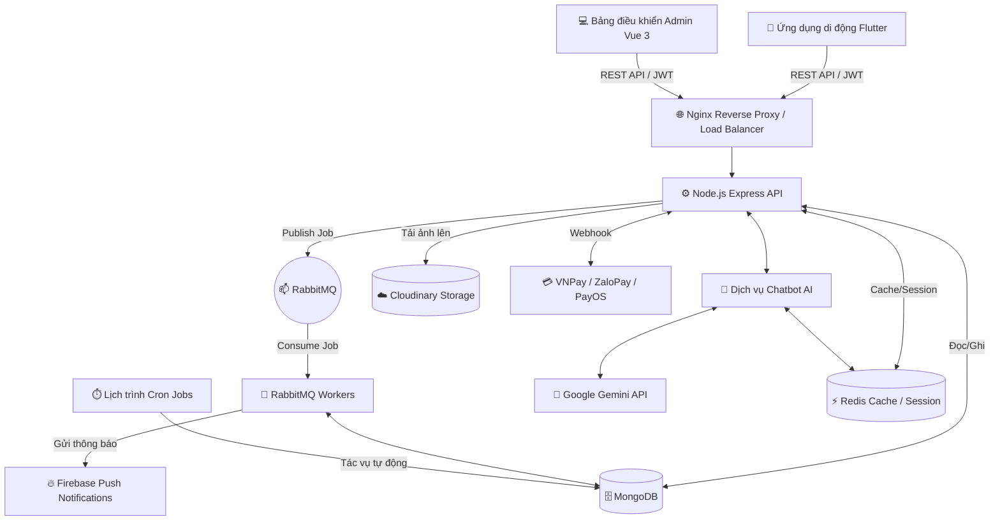

# 🌟 S-Shop: Nền tảng Thương mại Điện tử Toàn diện

Chào mừng bạn đến với **S-Shop**, nền tảng Thương mại Điện tử hiệu năng cao, đầy đủ tính năng được thiết kế nhằm mang lại trải nghiệm mua sắm mượt mà cho khách hàng và bộ công cụ quản lý mạnh mẽ cho quản trị viên.

Dự án này được xây dựng theo kiến trúc mô-đun hiện đại (tương tự microservices), tích hợp ứng dụng di động đa nền tảng, bảng điều khiển quản trị (admin dashboard) trên web, API backend mạnh mẽ và trợ lý chatbot AI thông minh.

---

## 🏗 Tổng quan Hệ thống: Kiến trúc (System Architecture)

Hệ sinh thái S-Shop được chia thành nhiều lớp chuyên biệt nhằm đảm bảo khả năng mở rộng (scalability), khả năng bảo trì (maintainability) và hiệu năng tối đa ngay cả trong các sự kiện lượng truy cập cao như Flash Sale.

### Sơ đồ Kiến trúc (Khái niệm)


---

## 🚀 Công nghệ Sử dụng (Theo Mô-đun - Đã kiểm định & Xác minh)

### 1. 📱 Mobile App (Dành cho Khách hàng)
Nằm tại thư mục `ecommerce_user_FE/`
Ứng dụng dành cho khách hàng được xây dựng hướng tới sự mượt mà và khả năng tương thích đa nền tảng.
- **Framework:** Flutter (Dart) - Một mã nguồn duy nhất biên dịch ra ứng dụng native cho cả iOS và Android.
- **Quản lý trạng thái (State Management):** Riverpod & Provider (Sử dụng song song hai mô hình để xử lý trạng thái linh hoạt và mở rộng tốt).
- **Xác thực (Authentication):** Google Sign-In, Đăng nhập/Đăng ký bằng Email/Mật khẩu dựa trên JWT tùy chỉnh.
- **Lưu trữ cục bộ (Local Storage):** `flutter_secure_storage` để mã hóa token, `shared_preferences` cho các cài đặt không nhạy cảm của ứng dụng.
- **Mạng (Networking):** Gói `http` với các wrapper tùy chỉnh để gọi API và chặn request/response (interceptors) mạnh mẽ.
- **Thông báo đẩy (Push Notifications):** Firebase Cloud Messaging (`firebase_messaging`, `flutter_local_notifications`).
- **Giao diện (UI/UX):** Material Design 3, hiệu ứng chuyển động tùy chỉnh (`flutter_animate`), danh sách vuốt slidable (`flutter_slidable`), và danh sách lưới (grid view) cho danh mục sản phẩm.

### 2. 💻 Admin Dashboard (Giao diện Quản trị)
Nằm tại thư mục `ecommerce_admin_FE/`
Giao diện web phản hồi linh hoạt (responsive) dành cho chủ cửa hàng và quản lý để kiểm soát tồn kho và theo dõi đơn hàng.
- **Framework:** Vue.js 3 (Composition API) mang lại giao diện người dùng hiện đại, nhẹ nhàng và phản hồi nhanh.
- **Công cụ Build (Build Tool):** Vite cho khả năng Thay thế Mô-đun Nóng (HMR - Hot Module Replacement) cực nhanh và tối ưu hóa bản build production.
- **HTTP Client:** Axios với bộ chặn request/response toàn cục được tùy chỉnh chuyên sâu để xử lý logic Refresh Token mượt mà và tránh tình trạng race condition.
- **Điều hướng (Routing):** Vue Router với Navigation Guards để bảo vệ các tuyến đường chỉ dành cho admin và tự động chuyển hướng khi token hết hạn.
- **Styling:** CSS thuần (`style.css`), không phụ thuộc vào các UI framework cồng kềnh bên ngoài, giúp giảm tối đa dung lượng bundle.

### 3. ⚙️ Core Backend API
Nằm tại thư mục `ecommerce_backend/`
Trái tim của hệ thống, xử lý logic kinh doanh, lưu trữ dữ liệu và bảo mật.
- **Runtime:** Node.js (v18+)
- **Framework:** Express.js áp dụng mô hình MVC (Model-View-Controller).
- **Cơ sở dữ liệu (Database):** MongoDB với Mongoose ODM (`mongoose`).
- **Caching & Sessions:** Redis (`redis`) cho các thao tác đọc cực nhanh và quản lý phiên làm việc.
- **Xác thực (Authentication):** JWT (JSON Web Tokens) với chiến lược Access Token & Refresh Token, mã hóa mật khẩu bằng `bcryptjs`.
- **Tải tệp lên (File Uploads):** `multer` tích hợp với Cloudinary (`multer-storage-cloudinary`) để tối ưu hóa việc phân phối hình ảnh và caching qua CDN.
- **Xử lý Thanh toán:** Tích hợp trực tiếp với **VNPay**, **ZaloPay**, và **PayOS** bao gồm cả bộ lắng nghe Webhook an toàn.
- **Thông báo đẩy (Push Notifications):** Firebase Admin SDK (`firebase-admin`) để cập nhật trạng thái đơn hàng thời gian thực.

### 4. 🧠 Dịch vụ Chatbot AI Thông minh
Tính năng tiên tiến cung cấp dịch vụ hỗ trợ khách hàng 24/7 và tìm kiếm sản phẩm theo ngữ nghĩa (semantic search).
- **Core Engine:** Google Gemini AI (thông qua `@google/generative-ai`).
- **Kiến trúc Caching Lai (Hybrid Caching Architecture):**
  - **Phân tích Ý định (Intent Parsing):** Chuyển đổi ngôn ngữ tự nhiên (ví dụ: "áo sơ mi nam trắng rẻ") thành truy vấn MongoDB có cấu trúc (`{"tag": "aosomi", "color": "Trắng"}`).
  - **Session ID Không Trạng thái (Stateless Session IDs):** Cho phép phân trang sâu mà không cần gọi lại Gemini API liên tục (tiết kiệm quota và thời gian):
    - Ý định JSON sau khi phân tích sẽ được băm (hash) và chuyển thành một **Chuỗi Base64** (sử dụng module native `Buffer.from` và `crypto.createHash('md5')` của Node.js).
    - Chuỗi này trở thành `sessionId` trả về cho ứng dụng Flutter thông qua gói `http`.
    - Khi người dùng cuộn xuống, Flutter gửi lại `?page=2&sessionId=ChuỗiBase64`.
    - Backend giải mã chuỗi ngược lại thành truy vấn MongoDB ngay lập tức bằng `Buffer`.
  - **Cache Ý định Toàn cục (Global Intent Caching):** Nhiều người dùng có cùng ý định tìm kiếm sẽ chia sẻ chung một Redis cache, tiết kiệm dung lượng RAM và hạn chế vượt quota API.
- **Bỏ qua Phân trang Sâu (Deep Pagination Bypass):** Đối với các trang 1-10, hệ thống sử dụng bộ đệm Redis cache. Đối với các truy vấn sâu (trang > 10), hệ thống sẽ linh hoạt bỏ qua cache và truy vấn trực tiếp vào MongoDB (`.skip().limit(20)`) để tránh tràn bộ nhớ.

### 5. 👷 Xử lý Hậu trường (Background Processing) & Hạ tầng
Để đảm bảo API chính luôn phản hồi nhanh chóng trong các đợt lượng truy cập tăng đột biến (như Flash Sale), các tác vụ nặng sẽ được đẩy xuống background.
- **Message Broker:** RabbitMQ (`amqplib`). Được sử dụng cho các tác vụ bất đồng bộ nhằm xử lý các thao tác nặng mà không làm tắc nghẽn event loop của Express.
- **Lập lịch Tác vụ (Task Scheduling):** `node-cron` chạy trong các container Docker hoàn toàn biệt lập. Tự động dọn dẹp các phiên hết hạn và tự động hủy các đơn hàng chưa thanh toán sau khoảng thời gian quy định.
- **Reverse Proxy:** Nginx. Xử lý SSL termination, cân bằng tải (load balancing) và phân phối các tệp tĩnh cho giao diện web.
- **Container hóa (Containerization):** Docker & Docker Compose đảm bảo tính đồng nhất về môi trường giữa Dev, Staging và Production.

---

## 🌟 Chi tiết các Tính năng

### 🛍️ Dành cho Khách hàng (Mobile App)
* **Xác thực Thông minh:** Đăng nhập mượt mà qua Google (`google_sign_in`) hoặc Email/Mật khẩu truyền thống với JWT. Duy trì phiên đăng nhập được mã hóa an toàn qua `flutter_secure_storage`.
* **Khám phá Sản phẩm Thông minh:** 
  * Bộ lọc nâng cao (Giá, Màu sắc, Kích thước, Danh mục, Đánh giá) ánh xạ trực tiếp tới các truy vấn Mongoose.
  * **Trợ lý Chatbot AI:** Tìm kiếm sản phẩm bằng ngôn ngữ tự nhiên (qua `@google/generative-ai`). Bot hiểu được các điều kiện lọc và sử dụng giao diện GridView dạng dọc trong Flutter để hiển thị gợi ý sản phẩm đẹp mắt.
* **Giỏ hàng & Thanh toán:**
  * Giỏ hàng được lưu trữ và đồng bộ qua Backend API (model `Carts` trong MongoDB) và cache cục bộ bằng `Riverpod`.
  * Kiểm tra tồn kho theo thời gian thực trong quá trình thanh toán thông qua truy vấn Mongoose vào mảng `sizes` lồng nhau.
  * Tích hợp với VNPay (`vnpay`), ZaloPay, và PayOS (`@payos/node`) cho các giao dịch ngân hàng nội địa hoặc Thanh toán khi nhận hàng (COD).
  * Hệ thống áp dụng Mã giảm giá (Voucher) ánh xạ tới model `Vouchers` để tính toán lại chính xác giá cuối cùng.
* **Quản lý & Theo dõi Đơn hàng:**
  * Lịch sử đơn hàng chi tiết với mốc thời gian theo dõi được trích xuất từ schema lưu trữ `Orders`.
  * Thông báo đẩy Firebase thời gian thực (`firebase_messaging`) được kích hoạt bất đồng bộ qua RabbitMQ khi trạng thái đơn hàng thay đổi.
* **Đánh giá Sản phẩm:** Hệ thống đánh giá dành cho mua hàng đã xác minh với số sao và bình luận được liên kết với schema `Reviews`.

### 👔 Dành cho Quản trị viên (Web Dashboard)
* **Tổng quan Báo cáo (Executive Overview):** Dashboard thời gian thực hiển thị các chỉ số cốt lõi được tính toán qua Mongoose Aggregation pipelines (`$group`, `$sum`).
* **Quản lý Sản phẩm (PIM):**
  * Thao tác Thêm, Xem, Sửa, Xóa (CRUD) cho sản phẩm sử dụng trạng thái phản hồi reactive của Vue 3.
  * Quản lý Biến thể (Variant): Dễ dàng quản lý số lượng tồn kho cho các kết hợp Màu sắc và Kích thước khác nhau.
  * Tải ảnh trực tiếp lên Cloudinary CDN thông qua `multer-storage-cloudinary` với tính năng tự động tạo đường dẫn.
* **Xử lý Đơn hàng:**
  * Danh sách quản lý đơn hàng được tải về thông qua Axios.
  * Cập nhật trạng thái chỉ bằng 1 cú nhấp chuột, xuất tác vụ vào RabbitMQ (`amqplib`), từ đó kích hoạt Thông báo đẩy Firebase (`firebase-admin`) đến điện thoại của khách hàng.
* **Quản lý Voucher:** Tạo và quản lý các mã khuyến mãi bằng các form giao diện Vue Router.

### ⚙️ Tính năng Hệ thống & Ngầm bên dưới (Under-the-Hood)
* **Tự động Hủy Đơn hàng Hết hạn:** Một cron-worker riêng biệt (`node-cron`) liên tục theo dõi collection `Orders`. Nếu đơn hàng thanh toán trực tuyến chờ quá thời gian cấu hình, hệ thống sẽ tự động hủy đơn và hoàn trả lại số lượng tồn kho.
* **Bảo mật Webhook:** Xác thực mã hóa các webhook từ VNPay, ZaloPay, và PayOS bằng chữ ký HMAC SHA512 với `crypto-js` để đảm bảo xác nhận thanh toán không thể bị giả mạo.
* **Khả năng Chịu lỗi Linh hoạt (Graceful Degradation):** Chatbot AI được thiết kế để hoạt động tốt ngay cả khi Redis gặp sự cố. Nếu Redis ngưng hoạt động, backend sẽ dùng `sessionId` được giải mã bằng `Buffer` native để tái tạo truy vấn trực tiếp vào MongoDB mà không làm gián đoạn trải nghiệm người dùng.
* **Giới hạn Tần suất Truy cập (Rate Limiting) & Bảo mật:** `express-rate-limit` chống tấn công DDoS vào các endpoint xác thực, kết hợp với `express-mongo-sanitize` để ngăn chặn các cuộc tấn công NoSQL Injection.

---

## 🗄️ Tổng quan Schema Cơ sở dữ liệu (MongoDB)

Mặc dù MongoDB là cơ sở dữ liệu schemaless, chúng tôi vẫn áp dụng cấu trúc schema nghiêm ngặt thông qua Mongoose. Dưới đây là các collection cốt lõi trong thư mục models:

1. **`Users` (`userModel.js`)**: Lưu trữ dữ liệu xác thực, vai trò (`admin`, `user`), hash mật khẩu, và thông tin người dùng.
2. **`Products` (`productModel.js`)**: 
   - Chứa thông tin cơ bản (tên, mô tả, giá gốc, giá sau giảm `finalPrice`).
   - **Lồng `colorVariants`**: Một mảng các màu sắc.
   - **Lồng `sizes`**: Bên trong mỗi màu sắc là một mảng kích thước và số lượng tồn kho `stock` tương ứng.
3. **`Categories`**: Logic phân loại danh mục sản phẩm.
4. **`Orders` (`orderModel.js`)**: 
   - Lưu bản chụp (snapshot) thông tin sản phẩm tại thời điểm mua.
   - Theo dõi `paymentMethod`, `paymentStatus`, `orderStatus`, và chi tiết `shippingAddress`.
5. **`Reviews` (`reviewModel.js`)**: Liên kết `userId` với `productId` cùng điểm đánh giá sao và bình luận văn bản.
6. **`Carts` (`cartModel.js`)**: Logic giỏ hàng lưu trữ các mảng biến thể sản phẩm được chọn và số lượng tương ứng.
7. **`Vouchers` (`voucherModel.js`)**: Mã giảm giá kèm ngày hết hạn và thông số giảm giá.
8. **`Notifications` & `NotificationReads` (`notification.js`, `notificationRead.js`)**: Thông báo hệ thống và thông báo giao dịch, theo dõi trạng thái đã đọc của từng người dùng.

---

## 📂 Cấu trúc Thư mục Chi tiết

Xem chi tiết cách tổ chức mã nguồn để giúp các nhà phát triển dễ dàng điều hướng:

```text
ECOMMERCE_MOBILE_APP/
│
├── ecommerce_backend/          # Node.js Express API
│   ├── controllers/            # Xử lý request (phân chia User/Admin)
│   ├── models/                 # Định nghĩa Mongoose schema (8 models riêng biệt)
│   ├── routes/                 # Điều hướng các API endpoint
│   ├── services/               # Logic kinh doanh cốt lõi (ví dụ: chatBotService)
│   ├── middleware/             # Xác thực auth, xử lý lỗi, giới hạn rate limit
│   └── worker.js               # Xử lý tác vụ ngầm (background processor)
│
├── ecommerce_user_FE/          # Ứng dụng Flutter cho Khách hàng
│   ├── lib/
│   │   ├── models/             # Models dữ liệu Dart
│   │   ├── screens/            # Giao diện chính (Home, Cart, Profile, Checkout)
│   │   ├── widgets/            # Các component UI tái sử dụng (ví dụ: chatbot_widget)
│   │   ├── services/           # Tích hợp API và logic lưu trữ cục bộ
│   │   └── providers/          # Quản lý trạng thái với Riverpod/Provider
│
├── ecommerce_admin_FE/         # Bảng điều khiển Admin Vue 3
│   ├── src/
│   │   ├── views/              # Các trang giao diện (view components)
│   │   ├── components/         # Các widget UI tái sử dụng
│   │   ├── router/             # Cấu hình Vue Router
│   │   └── style.css           # CSS thuần
│
└── docker-compose.local.yml    # Điều phối container cho môi trường phát triển cục bộ (local dev)
```

---

## 🛡️ Thực thi Các Thực hành Bảo mật Tốt nhất

S-Shop chú trọng hàng đầu đến vấn đề bảo mật, bảo vệ cả dữ liệu khách hàng lẫn vận hành của cửa hàng:
- **Xác thực JWT:** Access token thời gian sống ngắn kết hợp với cơ chế xoay vòng Refresh Token an toàn được xử lý trực tiếp trong Axios interceptors của Vue.
- **Mã hóa Mật khẩu:** `bcryptjs` với salt rounds động.
- **Giới hạn Tần suất (Rate Limiting):** Tiết chế truy cập dựa trên IP đối với các tuyến đường nhạy cảm bằng `express-rate-limit`.
- **Cấu hình CORS:** Giới hạn nghiêm ngặt các domain truy cập từ Admin Dashboard và App Flutter để ngăn chặn các request cross-origin không hợp lệ.
- **Che giấu Dữ liệu (Data Obfuscation):** Mật khẩu và token nhạy cảm hoàn toàn được loại bỏ khỏi phản hồi API bằng tính năng `select: false` của Mongoose.

---

## 🔌 Các API Endpoint Cốt lõi

Tài liệu tham khảo nhanh cho các ranh giới API được sử dụng nhiều nhất:

**Xác thực (Authentication):**
- `POST /api/auth/login` - Xác thực và nhận JWT
- `POST /api/auth/register` - Tạo tài khoản khách hàng mới
- `POST /api/auth/refresh` - Xoay vòng cấp mới access token

**Sản phẩm (Products):**
- `GET /api/products` - Lấy danh sách sản phẩm có phân trang và bộ lọc động
- `GET /api/products/:id` - Lấy chi tiết sản phẩm bao gồm các biến thể

**Chatbot AI:**
- `POST /api/chatbot/search` - Phân tích ngôn ngữ tự nhiên thành truy vấn MongoDB
- `GET /api/chatbot/loadmore` - Phân trang lưu trạng thái sử dụng Chuỗi Ý định Base64

**Đơn hàng & Thanh toán (Orders & Checkout):**
- `POST /api/orders/create` - Khóa tồn kho và tạo hóa đơn
- `POST /api/payments/webhook` - Bộ lắng nghe an toàn cho callback từ VNPay, ZaloPay và PayOS

---

## 🚀 Hướng dẫn Bắt đầu & Cài đặt

### Yêu cầu Tiên quyết
- Docker & Docker Compose (Khuyên dùng)
- Node.js (v18+) - Nếu chạy trực tiếp trên máy cục bộ
- Flutter SDK (v3.10+) - Để biên dịch ứng dụng di động
- Redis Server - Nếu chạy backend ngoài Docker

### 🐳 Cách Nhanh nhất (Docker)
Đây là phương pháp được khuyến khích để khởi chạy toàn bộ hệ sinh thái backend (API, Redis, MongoDB, RabbitMQ, Workers).

```bash
# 1. Clone repository
git clone <repository-url>
cd ecommerce_mobile_app

# 2. Thiết lập Biến Môi trường
cp ./ecommerce_backend/.env.example ./ecommerce_backend/.env
# (Hãy đảm bảo điền GEMINI_API_KEY, CLOUDINARY_URL và các key VNPay/ZaloPay/PayOS trong tệp .env)

# 3. Khởi chạy toàn bộ hạ tầng
docker-compose -f docker-compose.local.yml up -d --build

# 4. Kiểm tra các dịch vụ đang chạy
docker ps
```
Backend API sẽ sẵn sàng tại `http://localhost:5000`.

### 📱 Chạy Ứng dụng Di động (Flutter)
```bash
cd ecommerce_user_FE
flutter pub get
# Kết nối thiết bị thật hoặc khởi chạy máy ảo emulator
flutter run
```

### 💻 Chạy Bảng điều khiển Admin (Vue 3)
```bash
cd ecommerce_admin_FE
npm install
npm run dev
```
Admin Dashboard sẽ sẵn sàng tại `http://localhost:5173`.

---

## 🧪 Kiểm thử & Đảm bảo Chất lượng (QA)

Để duy trì độ tin cậy cao, S-Shop áp dụng chiến lược kiểm thử:
- **Kiểm thử Flutter:** Sử dụng `flutter_test` cho widget test và unit test trên frontend.
- **Kiểm thử API:** Các endpoint được thiết kế để kiểm thử toàn diện qua bộ sưu tập Postman để xác minh xác thực, khóa tồn kho và callback thanh toán.
- **Linting:** Áp dụng bộ quy chuẩn `flutter_lints` chuẩn để duy trì chất lượng code Dart.

---

## 🤝 Đóng góp (Contributing)
Chúng tôi hoan nghênh mọi đóng góp! Vui lòng tuân theo quy trình GitFlow chuẩn:
1. Fork repository
2. Tạo nhánh feature của bạn (`git checkout -b feature/AmazingFeature`)
3. Commit các thay đổi (`git commit -m 'Add some AmazingFeature'`)
4. Push lên nhánh (`git push origin feature/AmazingFeature`)
5. Mở một Pull Request
